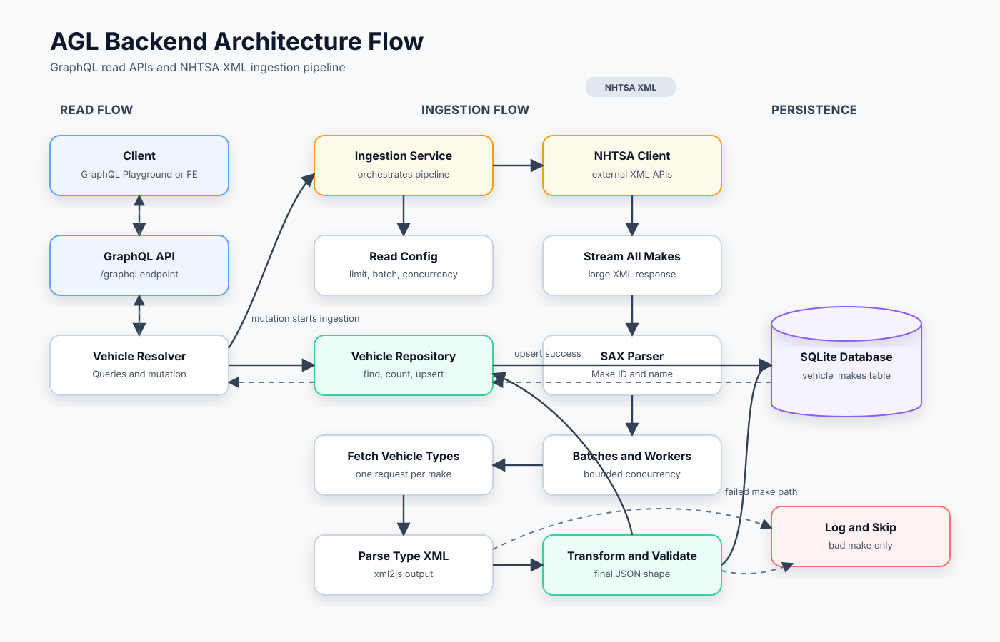

# Adglobal Backend Assignment

NestJS service that ingests XML from the public NHTSA vPIC APIs, transforms the data into a unified JSON structure, persists it in SQLite, and exposes the stored result through a single GraphQL endpoint.

## How Data Is Loaded

The NHTSA `GetAllMakes` API returns one large XML response and does not provide pages for this endpoint. The service reads that XML as a stream and processes `AllVehicleMakes` records in small batches, so it does not keep all 12k+ makes in memory at once. For each batch, it fetches vehicle types with limited concurrency and saves the transformed records to SQLite in chunks.

## Backend Flow



## Features

- Pulls all vehicle makes from `getallmakes?format=XML`.
- Pulls vehicle types per make from `GetVehicleTypesForMakeId/{makeId}?format=xml`.
- Transforms the combined data into:

```json
[
  {
    "makeId": 440,
    "makeName": "ASTON MARTIN",
    "vehicleTypes": [
      {
        "typeId": 2,
        "typeName": "Passenger Car"
      }
    ]
  }
]
```

- Persists transformed records in SQLite via TypeORM.
- Serves typed GraphQL queries and one ingestion mutation at `/graphql`.
- Uses validated environment configuration and structured JSON logs.

## Local Setup

```bash
git clone https://github.com/mukulsharma1323/agl-be.git
cd agl-be
npm install
cp .env.example .env
npm run start:dev
```

Open `http://localhost:3000/graphql`.

Run a limited ingestion while developing:

```graphql
mutation {
  ingestVehicleData(limit: 10) {
    requestedMakes
    savedMakes
    failedMakes
  }
}
```

Then query the stored data:

```graphql
query {
  vehicleMakes(limit: 10, offset: 0) {
    makeId
    makeName
    vehicleTypes {
      typeId
      typeName
    }
  }
}
```

## Configuration

All configuration is read from environment variables and validated with Zod at startup.

| Variable | Default | Description |
| --- | --- | --- |
| `NODE_ENV` | `development` | Runtime environment: `development`, `test`, or `production`. |
| `PORT` | `3000` | HTTP port for the NestJS server. |
| `DATABASE_PATH` | `data/vehicles.sqlite` | SQLite database file path. Use `:memory:` for tests. |
| `DATABASE_SYNCHRONIZE` | `true` in dev/test, `false` in prod | Whether TypeORM should create/update the SQLite schema on startup. Docker sets this to `true` for minimal local setup. |
| `LOG_LEVEL` | `info` | Pino log level. |
| `NHTSA_ALL_MAKES_URL` | vPIC all makes XML URL | Source endpoint for makes. |
| `NHTSA_VEHICLE_TYPES_URL_TEMPLATE` | vPIC make types XML URL | URL template; `{makeId}` is replaced per make. |
| `HTTP_TIMEOUT_MS` | `10000` | External API timeout. |
| `INGESTION_CONCURRENCY` | `8` | Number of vehicle type requests processed concurrently. |
| `INGESTION_BATCH_SIZE` | `250` | Number of makes processed and saved per ingestion batch. |
| `INGESTION_MAX_MAKES` | `0` | Optional cap for ingestion. `0` means all makes. |
| `INGEST_ON_STARTUP` | `false` | Automatically run ingestion during application bootstrap. |

## Data Model

`vehicle_makes`

| Column | Type | Notes |
| --- | --- | --- |
| `makeId` | integer primary key | NHTSA make identifier. |
| `makeName` | varchar | NHTSA make name. |
| `vehicleTypes` | JSON text | Array of `{ typeId, typeName }`. |
| `createdAt` | datetime | First persisted timestamp. |
| `updatedAt` | datetime | Last refresh timestamp. |

## GraphQL Schema

Core operations:

```graphql
type VehicleMakeEntity {
  makeId: Int!
  makeName: String!
  vehicleTypes: [VehicleTypeObject!]!
  createdAt: DateTime!
  updatedAt: DateTime!
}

type VehicleTypeObject {
  typeId: Int!
  typeName: String!
}

type Query {
  vehicleMakes(limit: Int = 50, offset: Int = 0): [VehicleMakeEntity!]!
  vehicleMake(makeId: Int!): VehicleMakeEntity
  vehicleMakeCount: Int!
}

type Mutation {
  ingestVehicleData(limit: Int): IngestionResultObject!
}
```

## Ingestion Pipeline

1. `NhtsaClient` streams the all-makes XML with Axios and parses each make using a SAX parser.
2. `vehicle-transformer` normalizes parser output, validates required fields, and maps it to the unified JSON shape.
3. `VehicleIngestionService` fetches vehicle types with bounded concurrency.
4. Failed make-level transformations are logged and skipped so one bad make does not fail the entire run.
5. Successfully transformed makes are upserted into SQLite per batch.

## Error Handling And Logging

- Network and XML parsing errors are logged with URL context.
- Transformation errors include the affected `makeId`.
- Unrecoverable ingestion failures are wrapped as GraphQL-safe internal errors.
- Request logs, startup events, shutdown signals, ingestion summaries, and unexpected failures are emitted as structured JSON through Pino.

## Build, Test, And Lint

```bash
npm run lint
npm test -- --runInBand
npm run test:e2e
npm run build
```

## Docker

```bash
docker build -t adglobal-be-assignment .
docker run --rm -p 3000:3000 --env-file .env adglobal-be-assignment
```

For quick Docker testing without a local `.env`, pass the most important values inline:

```bash
docker run --rm -p 3000:3000 \
  -e NODE_ENV=production \
  -e DATABASE_PATH=data/vehicles.sqlite \
  -e INGESTION_MAX_MAKES=10 \
  adglobal-be-assignment
```

## CI

GitHub Actions workflow lives in `.github/workflows/ci.yml` and runs:

- `npm ci`
- linting
- unit tests
- build
- Docker image build
